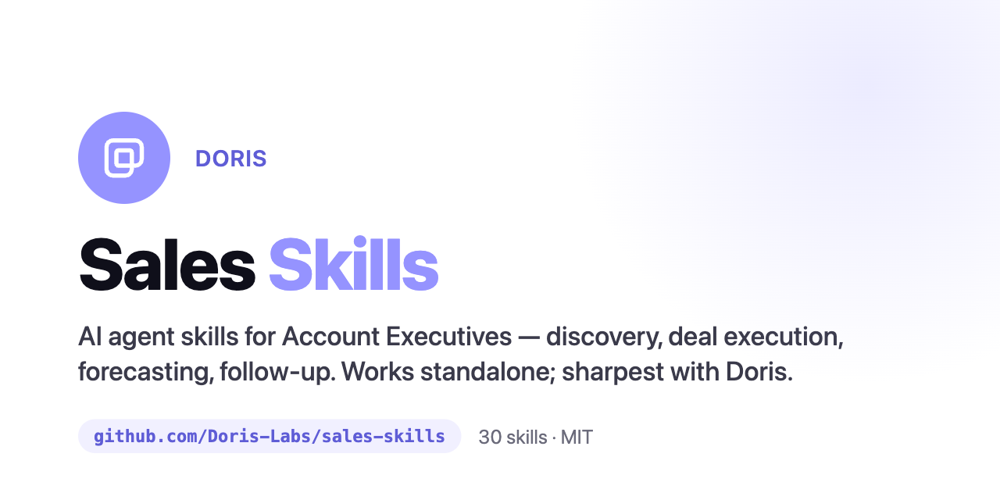

<p align="center">
  
</p>

# Sales Skills

AI agent skills for Account Executives — prospecting, discovery, deal execution,
qualification, forecasting, and follow-up. Install them into your AI coding agent
(Claude Code, Claude cowork, Cursor) and it gets good at the actual job of selling.

## Works with or without Doris

Every skill is **fully functional on its own** — paste your notes and go. Connect a tool
and it gets sharper. Connect [Doris](https://meetdoris.com) and it gets sharpest.

| Tier | What you connect | What you get |
|------|------------------|--------------|
| ✅ **Works** | Nothing — just your agent | Full methodology; you provide the inputs |
| ⚡ **Better** | Your CRM / Gong / Gmail MCP | Skills pull live deal + conversation data |
| 🚀 **Best** | Doris (`mcp.meetdoris.com`) | Evidence-backed: real commitments, objections, risks, MEDDPICC, and forecast pulled straight from your calls and pipeline |

The methodology never depends on a tool. Doris (and any CRM / conversation-intelligence
/ email MCP) just removes the copy-paste and grounds the output in real evidence.

## Install

Clone into your agent's skills directory:

```bash
git clone https://github.com/Doris-Labs/sales-skills.git
```

- **Claude Code / cowork:** point your plugins/skills path at this repo (it ships a
  `.claude-plugin/plugin.json`), or copy `skills/*` into your skills directory.
- **Cursor / other agents:** the skills are plain Markdown — add the `skills/` folder to
  your agent's context or rules.

Each skill auto-triggers on the phrases in its `Triggers on:` line (e.g. "follow up
email", "qualify this deal", "is this forecast clean").

**Start here:** `sales-context` captures your ICP, deal sizes, sales motion, and which
tools are connected once, so every other skill skips the basics.

## The 30 skills

### Foundation
- **sales-context** — the context every other skill reads first (ICP, deal sizes, motion, framework, connected tools).

### Prospecting & outbound
- **account-research** — a one-page account brief: firmographics, triggers, buying committee, mapped pains, hypotheses.
- **prospecting** — a prioritized, "why now"-backed target list filtered to your ICP and scored on fit + intent.
- **cold-email** — outreach that earns a reply: one problem, a real hook, a single low-friction ask.
- **sequence-writing** — a multi-touch cadence with channel mix, timing, a distinct angle per touch, and a breakup email.
- **social-selling** — LinkedIn outreach that warms a prospect before the pitch, then a connection-note + first-message sequence.

### Pre-call & discovery
- **meeting-prep** — a one-page brief: who's in the room, why, what to ask, what to land, the next step.
- **discovery-planning** — a hypothesis-driven question tree and pain→impact→priority ladder.
- **discovery-call** — lead the call: uncover real pain, quantify it, lock the next step before hanging up.
- **stakeholder-mapping** — map the buying committee: power, sentiment, and the roles you haven't reached.

### Deal execution
- **demo-strategy** — a demo where every feature maps to a named pain, with one wow moment.
- **post-call-followup** — recap email + clear next steps + a clean, evidence-backed CRM update.
- **objection-handling** — turn an objection into a calm, evidence-backed response that keeps the deal moving.
- **mutual-action-plan** — a MAP with the buyer: backward-planned milestones, owners on both sides, the steps that gate close.
- **competitive-battlecard** — honest where-you-win / where-they-win, landmines, trap questions, rebuttals, proof.
- **negotiation** — negotiate price and terms without caving; trade every concession for value.

### Qualification & deal health
- **meddpicc-qualification** — score the deal, separate evidence from assumption, turn gaps into next actions.
- **deal-risk-review** — diagnose slip/death risk, score each, prescribe a mitigation, give a R/Y/G verdict.
- **champion-building** — find, arm, test, and develop a real champion with power.
- **multithreading** — widen beyond a single contact: committee map, intro paths, a value angle per role.
- **closing-plan** — a step-by-step path to signature: every gate, owner, and date.

### Pipeline & forecast
- **deal-review-prep** — prep for a deal review/1:1: crisp one-liners, anticipated probes, the ask.
- **forecast-hygiene** — audit category discipline, evidence, and close-date sanity; output a defensible forecast.
- **pipeline-review** — coverage verdict, stage-health read, stalled-deal list, ranked "work this first".
- **crm-hygiene** — flag stale and contradictory fields against reality; produce write-back corrections.

### Expansion & retention
- **expansion-upsell** — map whitespace, read expansion signals, run land-and-expand, time the ask.
- **renewal-churn-save** — spot a renewal at risk, prove value delivered, run the save play.

### Artifacts
- **business-case-roi** — a defensible ROI model tied to the buyer's own stated metrics.
- **proposal** — a deal-specific proposal/SOW that mirrors the buyer's priorities and ends in one clear next step.
- **executive-briefing** — a one-page exec brief readable in 60 seconds, tailored to a CFO/CEO/CRO lens.

## How a skill is built

Every skill follows the same anatomy:

1. **Purpose** — the artifact/outcome it produces.
2. **Inputs** — what it needs from you.
3. **Method** — the actual frameworks, templates, and rules.
4. **Tool binding** — three tiers: **With Doris (recommended)** → **With a CRM / CI /
   email MCP** → **With nothing connected** (always complete).
5. **Works without Doris** — the manual path, restated.
6. **Common mistakes** — the quality bar.

See [`CONTRIBUTING.md`](CONTRIBUTING.md) to add or improve one. Run
`./validate-skills.sh` before opening a PR.

## Appendix: the Doris binding contract

The "With Doris" sections call the live Doris ontology — they're accurate, not
illustrative. Skills resolve an entity and request only the keys they need:

```
ontology_resolve(type_name, object_id, expand=[...])
ontology_search / ontology_list / ontology_aggregate / ontology_traverse
search_transcripts(...)
```

Available expand keys:

- **deal:** `stakeholders, objections, commitments, competitors, meetings, strategy,
  emails, agent_summary, activity, meddpicc, pain_points, value_drivers, tactics,
  assessments, brief, artifacts, pipeline_stages, risks, outcome, closure_strategies,
  competitor_results, products, close_date_changes, recommendations, similar_deals`
- **account:** `deals, contacts, meetings, activity, sentiment`
- **person:** `deals, meetings, company, emails`

## License

MIT © 2026 Doris Labs. See [LICENSE](LICENSE).
